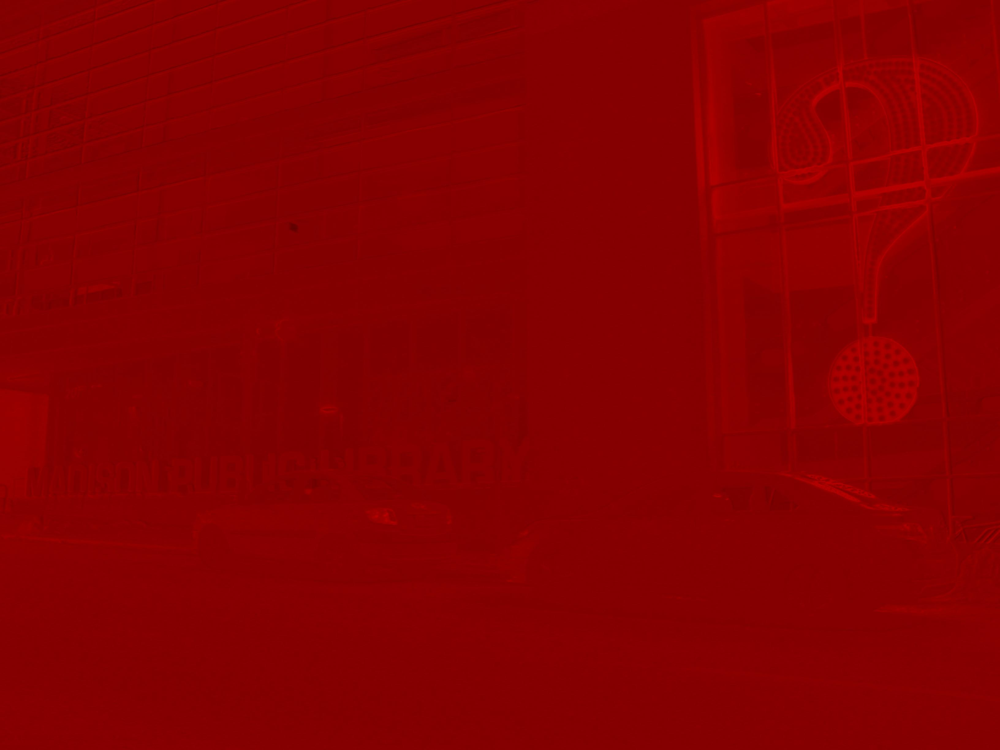

# HDR Imaging Project

This project is our implementation in Matlab of High Dynamic Range (HDR) imaging for Spring 2015 CS 766 Computer Vision at UW-Madison. 

## Group
* Felipe Gutierrez 
* Isaac Sung

## Running the program

To run the program, first create a subdirectory with all the images and a corresponding text file named "list.txt" containing a space-separated list of the image file names and the corresponding shutter speed (in floating point format). Each line should contain a separate image. For example, if the subdirectory contained two photos with shutter speeds 1 sec and 0.5 sec respectively, the text file should contain:


```
image1.jpg 1
image2.jpg 0.5

```

After creating the subdirectory and the corresponding list.txt file, change the *directory* variable in project1.m to point to that subdirectory. For example, if you created a folder called "images," change the line of code to read:


```
#!matlab

directory = './images/';
```

The ending '/' character is essential for the program to run correctly. After changing this line of code, press Run.

## Algorithm

For our HDR pipeline, we used the algorithm as presented in [Szeliski's book](http://szeliski.org/Book/drafts/SzeliskiBook_20100903_draft.pdf) in chapter 10. 

### Step 1: Estimating radiometric response function

The first step to creating an HDR image is to estimate a camera response function using multiple photos taken with different exposures. The basic idea behind estimating the radiometric response function is to plot the irradiance values of each pixel, *Ei*, against the measured pixel value *zij* for each exposure, *tj*. However, because we cannot measure the irradiance, we must simultaneously estimate *Ei* while estimating the response function. By setting up an inverse log function, we are able to set up a least squares equation. We used Debevec's algorithm to solve this system and obtain our *g* function which is our radiometric response function.

This whole procedure was done with a set of randomly sampled pixels (1000 pixels) from the image in each of the R G and B channels. Then we estimated the radiometric response for each RGB component using the algorithm described above.

### Step 2: Estimating radiance map for the HDR image

The second step in the process is to create a radiance map by combining the pixel values from each image. Because the response function and images are noisy, we must use a weighted function to weight the values. We used the equation used in Szeliski's chapter (also adapted from Debevec's paper) to calculate the radiance map.

#### RGB space vs L\*a\*b\* space

We experimented by applying the radiance map algorithm to the RGB color space as well as the L\*a\*b\* space. For the RGB color space, we applied the radiance map function to each color channel separately then re-combined them at the end of the pipeline. For the L\*a\*b\* space, we took two different approaches: 1) we applied the radiance mapping to only the luminance channel and used the median a and b color channels. 2) we applied the radiance mapping to all three channels. 

#### RGB Space

Reinhards global tone mapping resulted in much better results than the local tone mapping, however the Matlab tonemap function gave the best results. This is unexpected because in the global tone mapping there is one function that is applied to all the pixels. On the other hand in the local tone mapping there is a function for each pixel or spatial region of pixels. Therefore, one would expect greater detail in the local tone mapping output. The most plausible explanation for this is that we might have some bug in our implementation of the local tone mapping, which we have been trying to fix. The second explanation is that maybe the image just gives better results with global tone mapping.

#### L\*a\*b\*: luminance only

We tried to replicate the whole HDR process again but with an image in the L\*a\*b space. Since the chrominance (a and b) don't change across exposures we only made the luminance component go through the whole process and then took took the middle chrominance to display the image. This experiment failed to create an HDR image, as you can see in the 4th image. 

After giving some thought to it, this experiment was obviously going to fail. The reason for this is that the tone mapping algorithms we implemented compute the LUMINANCE of the input image. This means that we are computing the Luminance of the Luminance which as expected gave us a weird colored image (red version of the scene).

### Step 3: Tone map the HDR image back into a displayable gamut

The third step in the HDR imaging process is to tone map the HDR values back into lower range values that can be displayed on screens and printers. There are many methods to apply tone mapping to HDR images. In our project we have implemented different algorithms to compare and contrast the results. The tone mapping methods we implemented are Reinhard's global operator and Reinhard's local operator, as described in [Reinhard's paper](http://www.cmap.polytechnique.fr/~peyre/cours/x2005signal/hdr_photographic.pdf). We also used Matlab's built in tonemap function to generate our displayable image as well.

One interesting thing we stumbled upon when looking through the various tone mapping papers, was that many of them were based on the retinex theory and lightness perception theories. Which makes sense since the goal is to display an image that resembles what we are perceiving. 

#### Reinhard's local operator


#### Reinhard's global operator


#### Matlab's tonemap function


### Reinhards tonemap applied to image in Lab Space



## Credits

Some of our programming was done pair programming style. Felipe contributed mostly to the radiance mapping function and the Lab space implementation, and Isaac added the two Reinhard tone mapping functions. Both of us worked on debugging the code throughout the project. Detailed commits can be seen in the Commits section.

